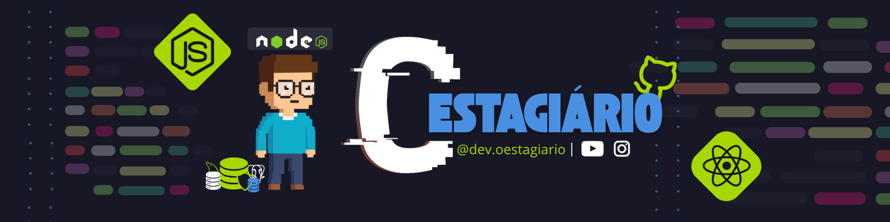

- 👨‍💻 Desenvolvedor autodidata apaixonado por tecnologia!
- 🚀 Estudando para dominar JavaScript, TypeScript, Node.js, React e bancos de dados SQL.
- 📺 Compartilhando a jornada de aprendizado no canal "O Estagiário" no YouTube.

## Sobre Mim

Olá! 👋 Sou O Estagiário, um aspirante a desenvolvedor full-stack de Dois Vizinhos, Paraná, embarcando em uma jornada de aprendizado autodidata no mundo da tecnologia. Decidi criar este espaço no GitHub e meu canal no YouTube, "O Estagiário," para documentar cada passo do meu progresso, compartilhar o que aprendo e conectar com outras pessoas que compartilham a mesma paixão.

## O Que Estou Estudando

Atualmente, meu foco principal é em:

  

Meu objetivo é adquirir um conhecimento sólido nessas tecnologias para construir aplicações web completas e resolver problemas do mundo real.

## Canal "O Estagiário" no YouTube

Acompanhe meu progresso e veja o que estou aprendendo em tempo real! No canal "O Estagiário", eu compartilho:

- Desafios e sucessos da minha jornada de aprendizado.
- Tutoriais e dicas sobre as tecnologias que estou estudando.
- A realidade do autodidatismo no mundo da programação (sem filtros!).
- A busca pelo "trampo daora" e as experiências do mercado de trabalho.

## Estatísticas do GitHub

Enquanto ainda não tenho projetos para mostrar, estou me dedicando a aprender e praticar! Em breve, este espaço estará cheio de código e contribuições.

## Contato

- 📫 Email: dev.oestagiario@gmail.com

## Minha Filosofia

> "A jornada de mil milhas começa com o primeiro commit." 🚀

Acredito que a paixão, a persistência e a vontade de aprender são as chaves para o sucesso na área de tecnologia. Estou ansioso para compartilhar minha jornada, aprender com a comunidade e construir um futuro incrível!
